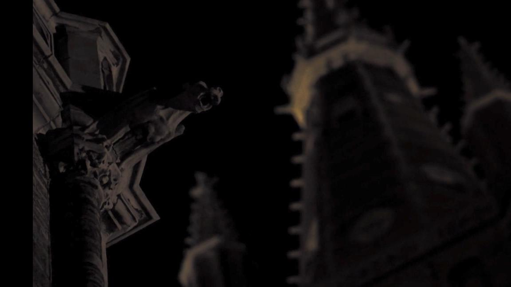
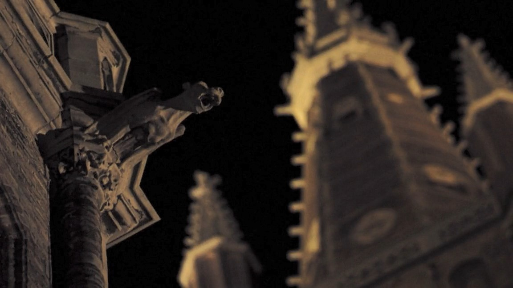
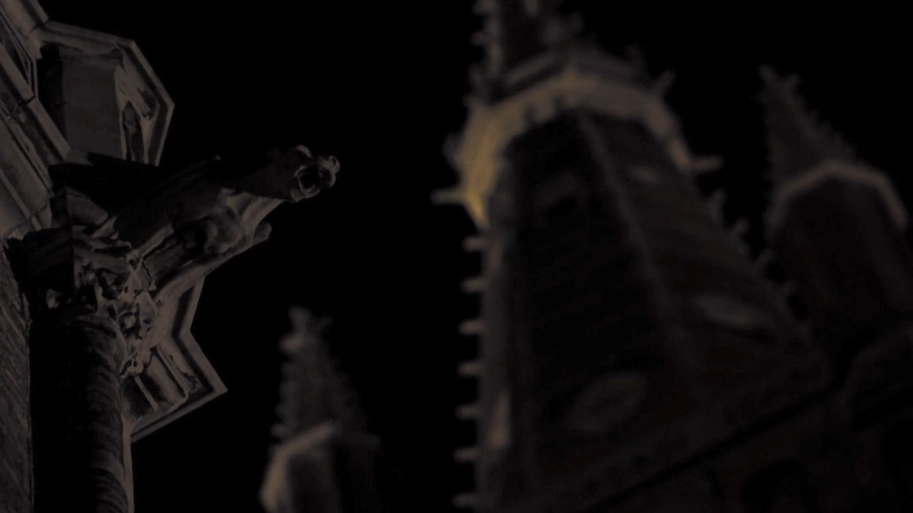
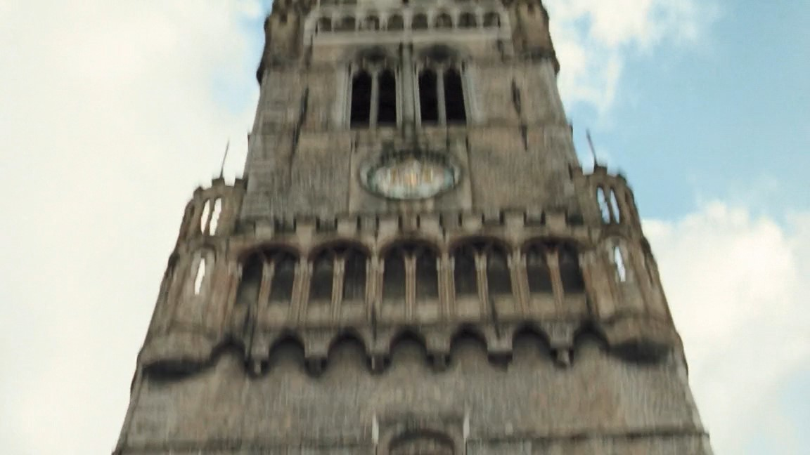

# image-shift

The program calculates the offset of one frame relative to the other. And for clarity, it shifts the second one to visually assess the accuracy. The idea is ingenious in its simplicity: shifting the function graph causes the Fourier coefficients to be multiplied by a phase that is linear in the shift. And then it's a matter of technique to factor it out. So, taking the inverse Fourier transform, we get a delta function. Its support is the desired displacement.

This is a proof of concept of the algorithm that can be used in video processing.

## Examples (output, frame1, frame2)








## Usage

```bash
python image_shift.py <image1> <image2> [image_output]
```

E.g.
```bash
python image_shift.py image1.jpg image2.jpg image_output.jpg
```

## Installing dependencies using virtual environment

```bash
# Create a virtual environment for the project
python3 -m venv venv

# Activate it
source venv/bin/activate

# Now install packages
pip install numpy Pillow

# Run the script
python image_shift.py img1.jpg img2.jpg

# When done, deactivate
deactivate
```
